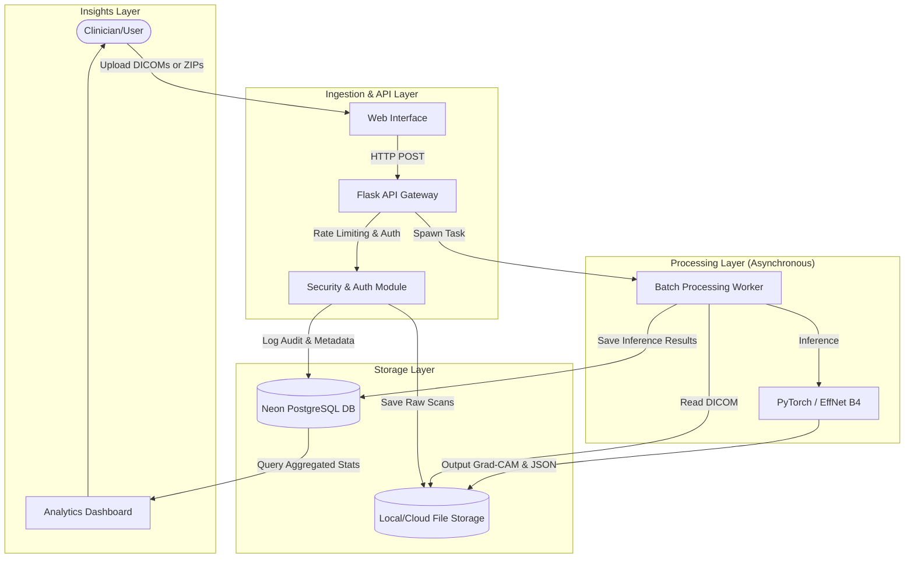

## System Architecture

Our pipeline is designed for multi-tenant medical data isolation, asynchronous batch processing, and scalable inference.

### Key Code Components

If you are exploring the codebase, here are the key modules that power this pipeline:

*   **Multi-Tenant Security & Data Pipeline (`data_isolation.py`):** 
    I built a `UserDataManager` to ensure strict data isolation between medical professionals. This guarantees that users can only access and view their own reports and uploaded DICOMs, maintaining strict privacy.
*   **Database Schema & History (`models.py`):**
    I designed a normalized PostgreSQL schema hosted on Neon. The `ScreeningReport` table tracks everything from raw probabilities to triage urgency, allowing the system to query historical trends and generate dashboard analytics.
*   **Asynchronous Batch Processing (`app_new.py`):**
    Instead of blocking the UI during heavy ML inference, I built an asynchronous worker (see `_start_batch` and `_run_batch_worker`) that processes entire directories or ZIP files of DICOMs in the background, updating the frontend batch status in real-time.
*   **AI Integration (`run_interface.py`):**
    This acts as the adapter layer that translates web requests into PyTorch tensor operations, generates the Grad-CAM visual heatmaps, and applies isotonic temperature calibration to the model's output probabilities.

### System Screenshots

*(Note: Add your actual images here)*

1.  **Analytics Dashboard:** Displays the insights layer, including Total Cases, Positivity Rate, and Average Confidence across the user's history.
2.  **Batch Processing UI:** Shows the asynchronous pipeline handling a queue of multiple DICOM files without freezing the app.
3.  **Visual Report:** Displays a specific patient report featuring the generated Grad-CAM heatmap alongside Urgency and Confidence metrics.
